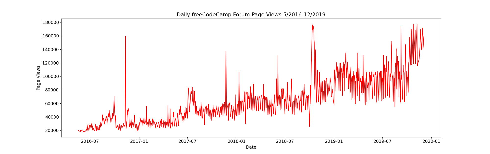
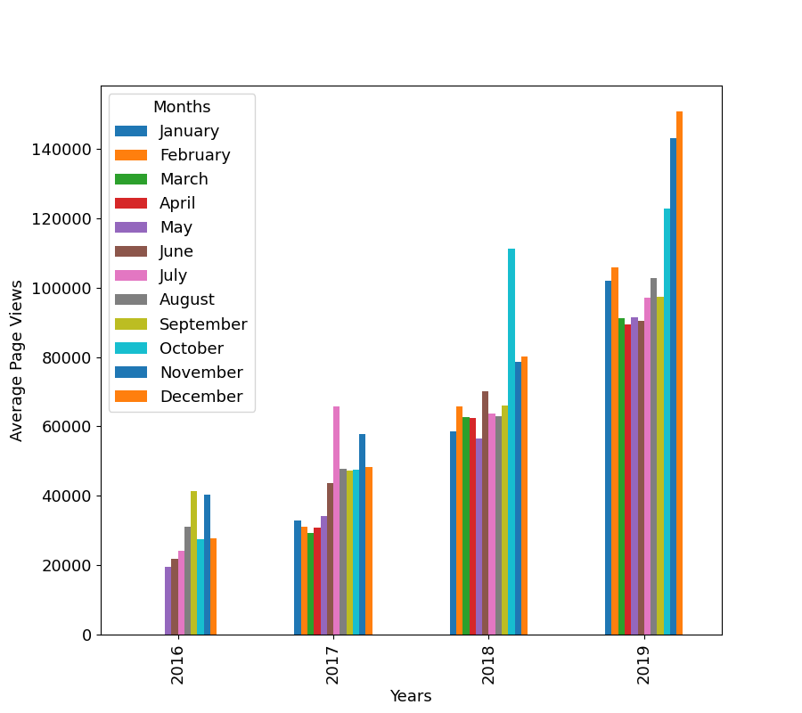
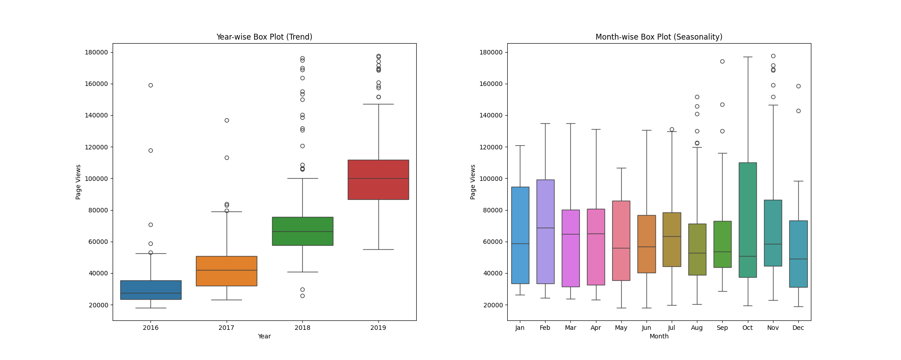

# Page View Time Series Visualizer

In this project, I visualized time series data using a line chart, bar chart, and box plots. I used Pandas, Matplotlib, and Seaborn to visualize a dataset that contains the number of page views on the freeCodeCamp.org forum from May 9, 2016, to December 3, 2019. These visualizations will provide insights into visit patterns and yearly/monthly growth trends.

